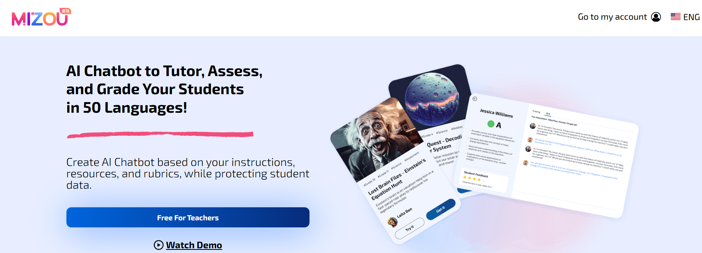
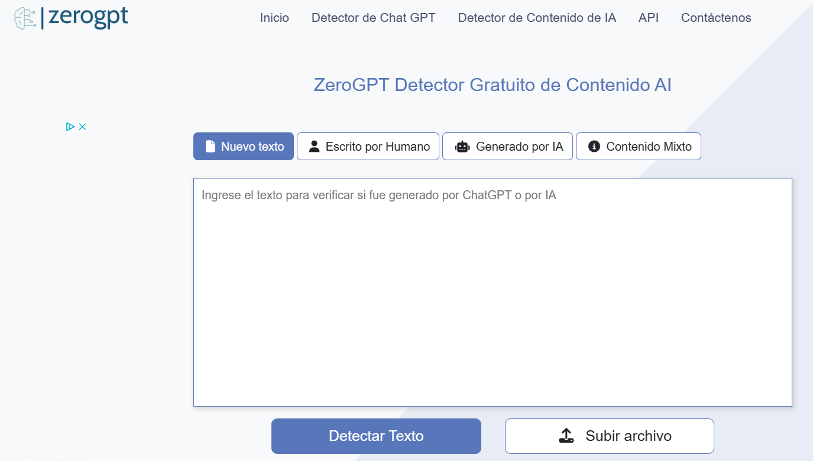
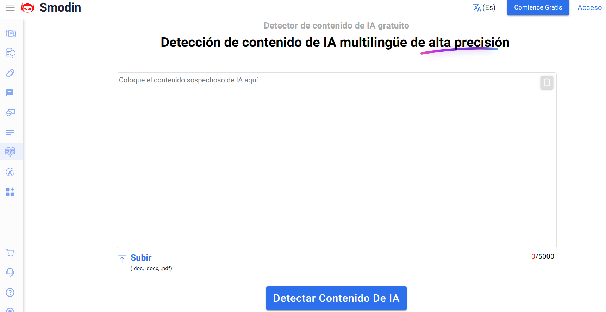

--- 
title: IA generativa para autoaprendizaje
summary: Las IA generativas pueden utilizarse para desarrollar acciones autoformativas que incrementen las competencias de manera autónoma. En el ámbito académico y educativo hay que gestionar el problema del plágio.
authors:
    - Manuela Iborra
    - Jose Robledano
date: 2024-03-18
---
# Autoaprendizaje

Organizar el autoaprendizaje utilizando una inteligencia artificial generativa puede ser una experiencia enriquecedora y efectiva. Ideas para lograrlo:

1. **Establece tus objetivos de aprendizaje**: Antes de empezar, define claramente lo que quieres lograr con tu autoaprendizaje. Pueden ser objetivos específicos, como mejorar tus habilidades en un área particular, aprender un nuevo idioma o dominar una herramienta tecnológica.

2. **Identifica recursos de aprendizaje**: Busca recursos de aprendizaje que te ayuden a alcanzar tus objetivos. Esto puede incluir libros, cursos en línea, tutoriales, artículos, videos educativos y más. También puedes considerar utilizar inteligencias artificiales generativas, como ChatGPT, para generar contenido relevante y personalizado para tu aprendizaje.

3. **Utiliza la inteligencia artificial generativa como recurso complementario**: La inteligencia artificial generativa puede ser una herramienta valiosa para complementar tus recursos de aprendizaje existentes. Puedes utilizarla para generar explicaciones adicionales, ejemplos prácticos, resúmenes de conceptos complejos o incluso para responder a preguntas específicas que puedas tener sobre el tema que estás estudiando.

4. **Interactúa con la inteligencia artificial generativa de manera regular**: Establece sesiones regulares de interacción con la inteligencia artificial generativa para maximizar su beneficio. Puedes dedicar un tiempo específico cada día o cada semana para hacer preguntas, recibir explicaciones o explorar nuevos conceptos generados por la inteligencia artificial.

5. **Evalúa tu progreso**: A medida que avanzas en tu autoaprendizaje, evalúa regularmente tu progreso hacia tus objetivos. Observa cómo has mejorado en las áreas que estás estudiando y ajusta tu enfoque de aprendizaje según sea necesario.

6. **Itera y mejora**: Aprovecha los comentarios que recibes de la inteligencia artificial generativa y de otras fuentes para iterar y mejorar continuamente tu proceso de autoaprendizaje. A medida que adquieras más conocimientos y habilidades, podrás ajustar tus objetivos y seguir avanzando en tu camino de aprendizaje.

En resumen, organizar el autoaprendizaje utilizando una inteligencia artificial generativa implica establecer objetivos claros, utilizar una variedad de recursos de aprendizaje, interactuar regularmente con la inteligencia artificial generativa y evaluar tu progreso de manera continua.

## Proceso autoaprendizaje. Ejemplo práctico.

Este es un ejemplo de registro del proceso de autoaprendizaje realizado por un estudiante, para conocer el **sistema digestivo**, utilizando una inteligencia artificial generativa como ChatGPT:

---

**Objetivos de aprendizaje**:

1. Comprender la anatomía y función del sistema digestivo.
   
2. Identificar los órganos principales y su papel en el proceso digestivo.
   
3. Aprender sobre los diferentes pasos del proceso digestivo y cómo se descompone y absorbe los alimentos.
   

**Interacción con ChatGPT (registro de acciones realizadas)**:

Durante un período de una semana, interactué con ChatGPT para obtener explicaciones adicionales y respuestas a mis preguntas sobre el sistema digestivo. Hice preguntas sobre los órganos que componen el sistema digestivo, el proceso de digestión, la absorción de nutrientes y cualquier otro concepto relacionado con el tema.

**Registro de interacciones**:

- Pregunté a ChatGPT sobre la función específica de cada uno de los órganos del sistema digestivo, como el estómago, el hígado y el intestino delgado.
  
- Solicité ejemplos prácticos sobre cómo se descompone y absorbe un alimento específico durante el proceso digestivo.
  
- Pedí explicaciones adicionales sobre términos y conceptos que no entendía completamente, como la función de las enzimas digestivas y el papel de la microbiota intestinal.
  

**Evaluación de la comprensión**:

Al final de la semana, realicé una prueba sobre el sistema digestivo para evaluar mi comprensión del tema. La prueba incluyó preguntas sobre la anatomía del sistema digestivo, el proceso de digestión y absorción de nutrientes, y el papel de los diferentes órganos en el proceso digestivo. Obtuvé una puntuación alta en la prueba, lo que indica que había comprendido los conceptos clave del sistema digestivo.

**Reflexión sobre el aprendizaje**:

ChatGPT fue una herramienta valiosa para mi autoaprendizaje del sistema digestivo. Me proporcionó explicaciones claras y concisas sobre los conceptos, respondió a mis preguntas de manera detallada y me ayudó a comprender mejor los procesos complejos involucrados en la digestión y absorción de alimentos.

**Ajuste de estrategias de aprendizaje**:

Basándome en mi experiencia de aprendizaje con ChatGPT, seguiré utilizando esta herramienta como recurso complementario para futuros temas de estudio. También continuaré explorando otros recursos y enfoques de aprendizaje para seguir ampliando mis conocimientos sobre el sistema digestivo y otros temas relacionados con la biología humana.

---

Este es un ejemplo de cómo podrías estructurar y documentar tu experiencia de autoaprendizaje utilizando una inteligencia artificial generativa como ChatGPT para estudiar el sistema digestivo. 

¡Recuerda que el profesorado también necesita formarse! Ahora es tu turno.

## Chatbot

Un **chatbot** es un programa informático que simula la conversación humana con un usuario final. Los chatbots actuales utilizan técnicas de IA conversacional como el Procesamiento del Lenguaje Natural (PLN) para comprender las preguntas y automatizar las respuestas.

Los chatbots se utilizan en muchas aplicaciones de mensajería y chat, principalmente para dar soporte y atención al cliente.

Accedemos a gratuito para profesores:

### Herramienta Mizou

Mizou es una herramienta creada para docentes que te permite crear tu propio chatbot basado en tus instrucciones, recursos y rúbricas.

[Mizou](https://mizou.com/){:target="_blank"}

# Plágio y citación

.......

## **Propiedad Intelectual en IA**

La propiedad intelectual se refiere a los derechos legales que protegen las creaciones de la mente, como obras literarias, artísticas, invenciones, diseños, símbolos y nombres. En el contexto del uso de ChatGPT y otras IA generativas, la propiedad intelectual se ve desafiada debido a la forma en que estas tecnologías generan contenido utilizando una amplia gama de datos disponibles públicamente en Internet, sin necesariamente citar a los autores originales. Esto plantea preocupaciones sobre la violación de derechos de autor y la falta de reconocimiento a los creadores originales de los contenidos utilizados para entrenar estas IA.

En el caso de ChatGPT, al ser entrenado con datos de terceros sin necesariamente contar con permisos explícitos de los creadores originales, se cuestiona si los resultados generados por la IA pueden ser protegidos por derechos de autor. Según la legislación actual en España, los resultados generados íntegramente por ChatGPT no serían protegibles bajo derechos de autor, ya que la propiedad intelectual de una obra corresponde al autor por el mero hecho de su creación, y en España solo las personas físicas pueden ser consideradas autores.

Por otro lado, hay quienes sostienen que el ususario que crea el **prompt** debe ser considerado el autor y tener la propiedad intelectual.

La legislación actual no contempla el caso de obras creadas con IA por lo que existe un vacío legal y por ello se asume que el usuario que genera el prompt tiene algún derecho sobre lo que genera la IA.

## **Uso responsable de la IA en el aula**

- Verificación de Información: Contrastar la información producida por la IA con fuentes confiables antes de utilizarla en el aula.
- Análisis Crítico de Contenidos: la información generada se debe someter a un análisis crítico para evaluar su precisión y relevancia.
- Diversificación de Fuentes: Se recomienda utilizar diferentes herramientas para el aprendizaje, sin depender únicamente de la IA.
- Seguridad de Datos: Se debe ser cauteloso al compartir información personal con plataformas basadas en IA.
- Evaluación Complementaria: No se debe depender exclusivamente de la IA para evaluar el rendimiento del alumnado. Se recomienda utilizar diversos métodos de evaluación que consideren aspectos como la creatividad y el pensamiento crítico.
- Conciencia de Sesgo: Se debe ser consciente de que la IA puede tener sesgos inherentes y estar preparado para abordar cualquier desigualdad que pueda surgir.
- Formación Continua: Es esencial mantenerse actualizado sobre las mejores prácticas y las limitaciones de la IA para poder guiar de manera efectiva al alumnado.

## **Herramientas de detección de IA**

Estas herramientas se especializan en detectar contenido generado IA y pueden ser útiles para detectar plagio en textos generados por modelos de lenguaje como ChatGPT. Algunas herramientas importantes son:

- [**GPTZero**](https://zerogpt.net/es){:target="_blank"}

- [**Copyleaks**](https://copyleaks.com/es/ai-content-detector){:target="_blank"}

- [**Smodin**](https://smodin.io/es/detector-de-contenido-de-ia){:target="_blank"}

