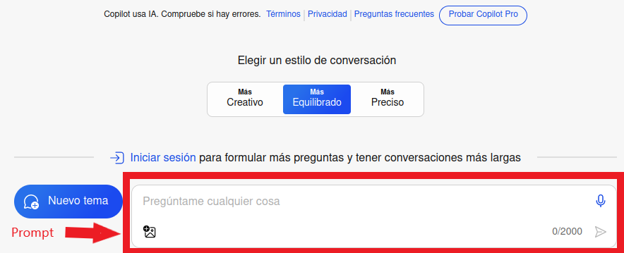
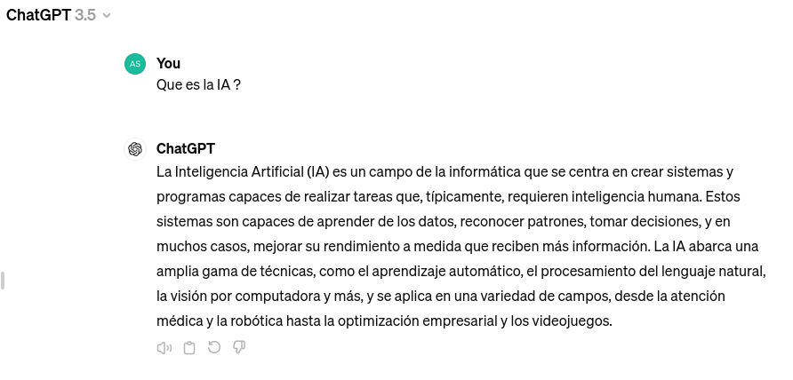

--- 
title: IA generativa conversacional
summary: Las IA generativas conversacionales se han hecho un lugar en el arco de digitalizacion de cualquier negocio. En educación, también aporta muchas referencias a nivel metodológico y conceptual.
authors:
    - Manuela Iborra
    - Jose Robledano
date: 2024-03-18
---
# IA conversacional

Esta tecnología ofrece una amplia gama de posibilidades para crear contenidos educativos innovadores y personalizados. Aquí te presento algunas formas en que se puede utilizar la IA generativa para este fin:

## **Generación de Problemas y Ejercicios**

La IA generativa puede ser utilizada para generar una variedad de problemas y ejercicios en diversas áreas del conocimiento. Por ejemplo, en matemáticas, puede generar problemas de práctica con diferentes niveles de dificultad o incluso adaptarlos al progreso individual del estudiante. En ciencias, puede generar simulaciones interactivas que permitan a los estudiantes experimentar con fenómenos naturales de manera virtual.

## **Creación de Material Didáctico Personalizado**

Con la IA generativa, es posible crear material didáctico personalizado que se adapte a las necesidades y preferencias de aprendizaje de cada estudiante. Esto incluye la generación de textos, gráficos, videos y otros recursos multimedia que aborden los intereses individuales de los estudiantes y refuercen los conceptos clave de manera efectiva.

## **Desarrollo de Tutoriales Interactivos**

La IA generativa puede ser utilizada para desarrollar tutoriales interactivos que guíen a los estudiantes a través de conceptos complejos de manera dinámica y personalizada. Estos tutoriales pueden adaptarse según el progreso del estudiante, proporcionando retroalimentación instantánea y sugerencias de mejora.

## **Creación de Contenido Creativo**

La IA generativa puede ser una herramienta poderosa para fomentar la creatividad en el aula. Por ejemplo, se pueden utilizar algoritmos generativos para crear obras de arte, composiciones musicales, historias o poemas originales. Esto no solo ayuda a los estudiantes a desarrollar su creatividad, sino que también les permite explorar diferentes formas de expresión artística.

## **Personalización del Material de Estudio**

Utilizando técnicas de IA generativa, es posible personalizar el material de estudio para adaptarlo a las necesidades individuales de cada estudiante. Esto incluye la generación de resúmenes, esquemas y ejemplos específicos que se ajusten al nivel de conocimiento y estilo de aprendizaje de cada estudiante.

!!! alert "Una poderosa herramienta"
    La IA generativa ofrece numerosas oportunidades para crear contenidos educativos dinámicos, interactivos y personalizados que pueden mejorar significativamente la experiencia de aprendizaje de los estudiantes. Al integrar esta tecnología de manera efectiva en el aula, los educadores pueden potenciar el proceso de enseñanza y ayudar a los estudiantes a alcanzar su máximo potencial.

## **Herramientas conversacionales**

Existen muchas herramientas que utilizan la IA generativa. Las más conocidas son:

Condiciones de uso

- ChatGPT: Es necesario estar registrado para su utilización. Hay una versión superior de pago por suscripción. La versión actual gratuita es ChatGPT 3.5. Una vez que iniciamos sesión, parece 

- Copilot:

- Gemini

## **El Prompt de la IA**

El **prompt** es una instrucción, una pregunta o un texto que se utiliza para interactuar con un sistema de IA. Es el elemento esencial para que la IA empiece a funcionar.

Según el tipo de prompt, vamos a tener un resultado más o menos optimizado.

!!! info
    Dada la importancia de conseguir un prompt optimizado, ha surgido un perfil profesional llamado *Ingeniero de prompts* para desarrollar instrucciones precisas para generar buenos resultados para la empresa.

Es importante que los prompts tengan todo el contexto que necesitas para obtener un resultado, y también que no tengan ambigüedades o dobles sentidos que puedan hacer que los algorimos de una IA interpreten de firna errónea lo que le pedimos.

### **Prompts efectivos**

Criterios para realizar un buen prompt:

- Preguntas claras y específicas.

- Utilizar palabras clave relacionadas con tu tema.

- Desglosar preguntas complejas en partes más simples.

- Comprobar la respuesta obtenida por si hay algo incorrecto.

- Cuando iniciamos una conversación con una IA, lo que ha dicho antes influye en las respuestas actuales, si se está cambiando de tema o no gusta cómo está respondiendo es mejor comenzar una conversación nueva.

- Experimentar. Si no se obtiene lo que se quiere, hay que probar a cambiar la forma de hacer las preguntas, los datos que le proporcionamos, el tono con el que le hablamos, el rol que le hemos proporcionado, etc.

Ejemplo de un prompt básico y correcto:

Un prompt contextualizado:

### **Elementos del prompt**

Una posible forma de generar un buen prompt puede ser la siguiente:

**[Rol] [Tema o Tarea] [Contexto] [usuario final]**

- **Rol**: Descripción de quien va a hacer la pregunta. Por ejemplo, un profesor que explica un concepto, un amigo dando consejos, un experto en un campo específico, etc. Este rol ayuda a definir el tono y el contexto de la respuesta que proporcionará el modelo.
- **Tema o tarea**: Descripción de la tarea específica o el tema que se quiere abordar. Puede ser una pregunta sobre un tema específico, una petición de ayuda con una tarea, una explicación de un concepto, etc.
- **Contexto**: Información del contexto o los detalles adicionales que ayudan a definir la situación. Por ejemplo, detalles sobre un problema que están intentando resolver.
- **Usuario final**: Esta es la persona o grupo de personas a las que se destina la respuesta. Podría ser el propio usuario, el alumnado de un nivel y asignatura en particular, una audiencia más general, etc. Este componente ayuda a definir el nivel de detalle, el tono y el lenguaje que deben utilizarse en la respuesta.

