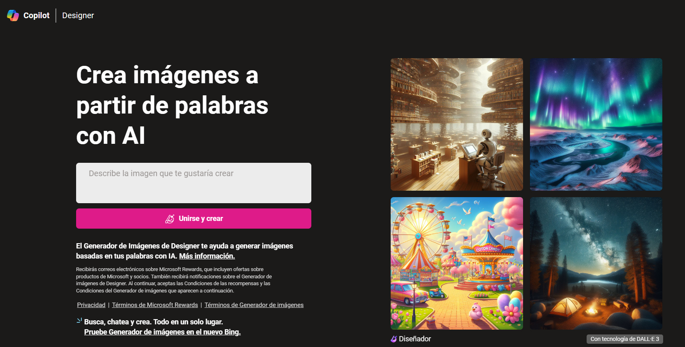
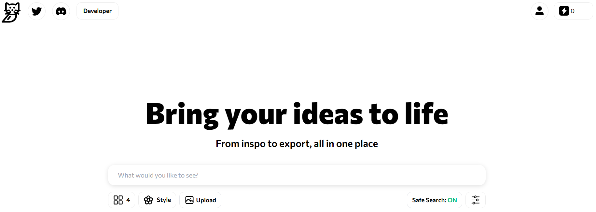
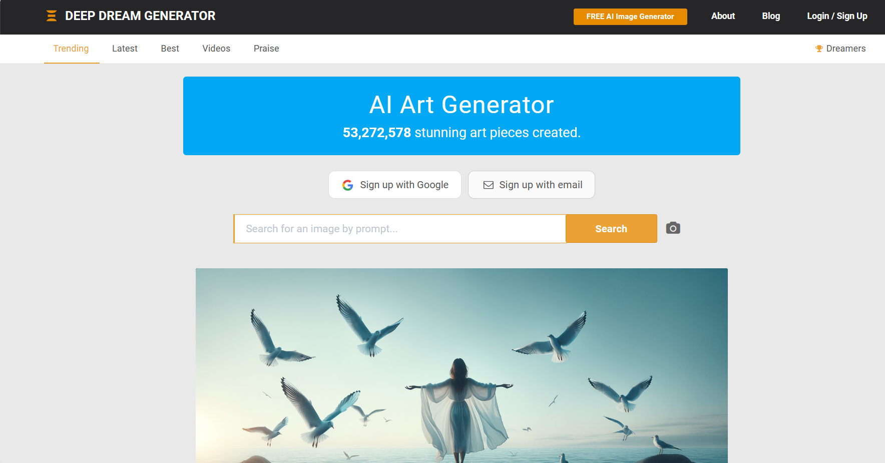
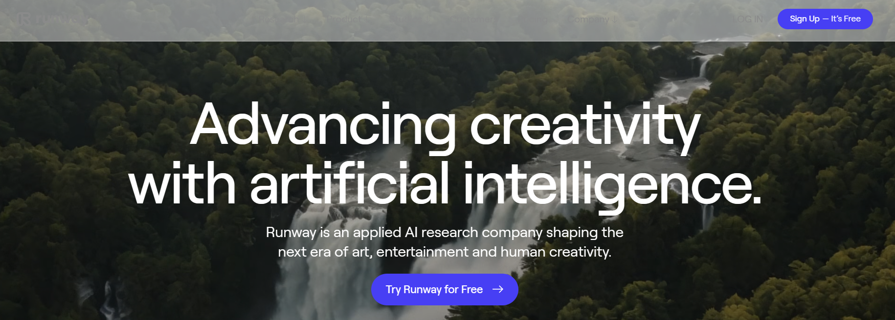
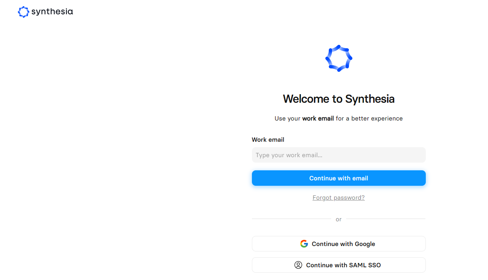

--- 
title: IA generativa imágenes y vídeos
summary: Las IA generativas de texto a imagen o vídeo, consiguen resultados impresionantes que bien pueden utilizarse directamente como ilustraciones. En educación, resulta fácil encontrar ideas gráficas para ilustrar mejor muchas de los materiales que se facilitan al alumnado.
authors:
    - Manuela Iborra
    - Jose Robledano
date: 2024-03-18
---
# **Generación de elementos gráficos**

La IA generativa permite crear elementos gráficos nuevos, que pueden ser utilizados libremente para la creación de materiales e informes.

Algunas de las limitaciones que presenta la IA generativa de imágenes son las siguientes:

- La mayoría de herramientas no permiten incluir texto en las imágenes y si lo hace no lo hace de forma correcta.
- La generación de algunos objetos no es muy precisa sobre todo con detalles científicos y técnicos.
- Muchas herramientas funcionan con un sistema de créditos o tokens que limitan el número de imágenes que se pueden crear.
  
## **Generando imágenes**

Las imágenes digitales se están formadas por **pixels**. Un pixel es la combinación de tres colores: rojo verde y azul (RGB). Se representa como un vector de valores numéricos.

Por tanto las imágenes son conjuntos de valor númericos. Representadas en forma de matrices multidimensionales con filas y columnas. Esta representación matemática de las imágenes facilita mucho su procesamiento en los modelos de Inteligencia Artificial.

Se han desarrollado diferentes modelos, para generar imágenes a partir de diferentes elementos:

- Instrucciones en texto.
- Imágenes.
- Audio.

!!! info "Prueba la generación instantánea"

    HuggingFace es una popular plataforma que almacena muchos modelos de inteligencia artificial con diferente propósito. 

    Dispone de un espacio, llamado **spaces** donde es posible publicar demostraciones de los modelos.

    Utiliza [el siguiente enlace](https://huggingface.co/spaces/diffusers/unofficial-SDXL-Turbo-i2i-t2i){:target=_blank} para probar la creacion de imágenes según vas escribiendo el texto.

## **Imagenes para la docencia**

El uso de las imágenes puede clasificarse de manera lineal; en un extremo está la precisión y los detalles exactos mientras que en el otro extremo se sitúa la creatividad. A lo largo de esta línea podemos situar también la utilidad de las imágenes en diferentes contenidos. 

Por ejemplo, si trabajamos contenidos de geografía los mapas tienen que ser preciso y ajustados a la realidad. Mientras que en plástica, las imágenes son más creativas.

La IA generativa de imágenes, no suele mostrar precisión en el resultado, de manera que es frecuente encontrar **alucinaciones** en la imagen, es decir elementos inconexos con el resto de la imagen, aunque puedan estar contextualizados con un sentido. Por ejemplo animales que les falta o sobra alguna pata, rasgos de la cara mal definidos, más dedos de la cuenta en una mano o cualquier otro detalle.

Sin embargo, esto no es un handicap para la Inteligencia Artificial generativa, ya que podemos solicitar la creación de **imágenes de inspiración**, que permiten ilustrar una actividad o ser el punto de partida. Por ejemplo, para las asignatura de historia del arte, se puede preparar una actividad de reconocimiento de estilos arquitectónicos generando imágenes de diferentes estilos. Aunque estas imágenes son sintéticas, mostrarán la esencia del estilo y son válidas para el propósito.

### **Herramientas para generar imágenes**

Existen muchos recursos que permiten la generación de imágenes aunque la mayoría tienen ciertas limitaciones de créditos o tokens. Algunas de ellas son las siguientes:

- **Generador de imágenes de Bing**: se puede acceder directamente desde el chat de Bing pidiéndole que nos haga una imágen. Utiliza DALLE 3 de OpenAI.
  
[Bing](https://www.bing.com/images/create?toWww=1&redig=37ADF736F405418EB0DED7E061E32E5B){:target="_blank"}

- **Stable Diffusion**: es de código abierto y genera una imagen a partir de un mensaje de texto. Puede resultar lenta si hay muchos usuarios a la vez generando imágenes. Te genera una serie de crédito de forma gratuita.

[Stablediffusion](https://stablediffusionweb.com/){:target="_blank"}

- **Catbird**: plataforma sencilla y fácil de usar.

[Catbird](https://www.catbird.ai/){:target="_blank"}

- **Deep Dream Generator**: generador que utiliza la técnica DeepDream desarrollada por Google. Permite cargar tus propias imágenes y aplicar efectos psicodélicos y surrealistas.

[deepdreamgenerator](https://deepdreamgenerator.com/){:target="_blank"}

!!!info "Acceso a servicios ""Gratuitos"" "

    Las condiciones de cada sitio pueden variar. Es importante revisar las condiciones para conocer qué prestaciones se reciben con el **registro gratuito**. Pagamos con el seguimiento y creación de un perfil de uso (**datos**).

    En algunos casos, el servicio gratuito es muy limitado o no se ajusta a lo que se quiere obteer, con lo cual el haber facilitado nuestros datos no será correspondido con ningún servicio satisfactorio.

## Generando vídeos 

Los vídeos no son más que secuencias de imágenes. Para una IA generativa que genera imágenes, no es ningún inconveniente generar una secuencia de imágenes relacionadas con la anterior, formando un vídeo.

Cada imágen se basa en la anterior generada, aplicando cierta modificación, en base a las instrucciones de creación que se hayan establecido.

### **Herramientas para generar vídeos**

- **RunWay ML**: plataforma que ofrece gran variedad de modelos de IA para generar imágenes, vídeos, textos, etc. 

[RunWay](https://runwayml.com/){:target="_blank"}

-**InVideoAI**: Crea vídeos a partir de su descripción en texto. Tiene una versión gratuita (aunque te tienes que registrar) que permite un tiempo limitado de uso y almacenamiento y 4 exportaciones por semana con el logo de la herramienta.

[InVideoAI](https://ai.invideo.io/workspace/eaf00b9c-4aa5-4a22-8f64-c37501671fb1/v20-copilot){:target="_blank"}

-**Synthesia STUDIO**: permite realizar vídeos a partir de textos que son narrados por un avatar. Es una herramienta gratuita y tiene una serie de limitaciones.

[Synthesia STUDIO](https://app.synthesia.io/#/welcome?redirect=%2F){:target="_blank"}

## Referencias

- **CIVITAI**. Interesante repositorio de prompts para generar imágenes y vídeos. [https://civitai.com/](https://civitai.com/){target="_blank"} Pulsando en el icono de la parte inferior derecha de cada *imagen muestra* libre o pública, se muestra la ficha con el prompt, positivo y negativo utilizado, el módelo y algunos datos más.

